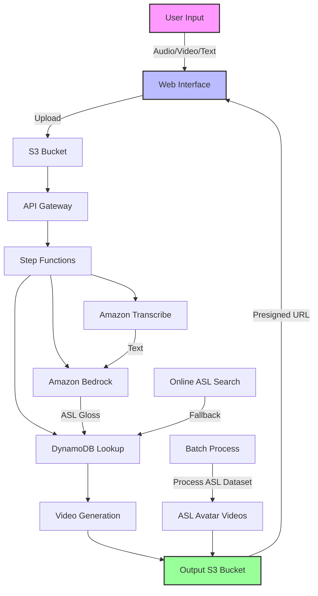
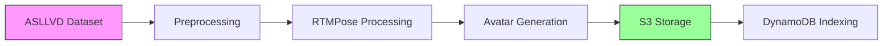

# GenASL - Generative AI powered American Sign Language Avatars

[](https://opensource.org/licenses/MIT-0)
[](https://aws.amazon.com/)
[](https://aws.amazon.com/generative-ai/)

## 🌟 Overview

GenASL is an innovative solution that bridges the communication gap between spoken/written language and American Sign Language (ASL) through AI-powered avatar technology. By leveraging cutting-edge AWS services and generative AI, GenASL translates speech or text into expressive ASL avatar animations, making digital content more accessible to the Deaf and hard-of-hearing community.

## ✨ Key Features

- **Multi-Input Support**: Process audio, video, or text inputs
- **Online ASL Video Search**: Automatically finds and downloads ASL videos when local data is unavailable
- **High-Quality Avatars**: Realistic ASL avatar generation using RTMPose and MMPose
- **Cloud-Native**: Built on AWS serverless architecture for scalability and reliability
- **Web-Based Interface**: Easy-to-use web interface built with AWS Amplify

## 🚀 Getting Started

### Prerequisites

- AWS Account with appropriate permissions
- Node.js and npm installed
- AWS CLI configured with appropriate credentials
- Python 3.8+ for batch processing

### Quick Start

1. **Clone the repository**:
   ```bash
   git clone https://github.com/aws-samples/genai-asl-avatar-generator.git
   cd genai-asl-avatar-generator
   ```

2. **Deploy the backend**:
   ```bash
   cd backend
   sam build
   sam deploy --guided
   ```

3. **Set up the frontend**:
   ```bash
   cd ../frontend
   npm install --force
   amplify init
   amplify add hosting
   amplify publish
   ```

## 🏗️ Architecture



### Core Components

1. **Frontend**
   - Built with AWS Amplify
   - Responsive web interface
   - Real-time processing status

2. **Backend Services**
   - **API Gateway**: Handles incoming requests
   - **Step Functions**: Orchestrates the workflow
   - **AWS Lambda**: Serverless compute for processing
   - **DynamoDB**: Stores ASL gloss to video mappings

3. **AI/ML Services**
   - **Amazon Transcribe**: Converts speech to text
   - **Amazon Bedrock**: Translates text to ASL gloss
   - **RTMPose/MMPose**: Generates avatar animations

1. **Amazon EC2 instance** initiates a batch process to create ASL Avatars from a video data set consisting of  8000+ poses using RTMPose, a Real-Time Multi-Person Pose Estimation toolkit based on MMPose.
2. **AWS Amplify** distributes the GenASL web app consisting of HTML, JavaScript, and CSS to end users’ mobile devices.
3. The **Amazon Cognito** Identity pool grants temporary access to the Amazon S3 bucket.
4. The user uploads an audio file to the Amazon S3 bucket using AWS SDK through the web app.
5. The GenASL web app invokes the backend services by sending the **Amazon S3** object Key in the payload to an API hosted on Amazon API Gateway. 
6. **Amazon API Gateway** instantiates an AWS Step Functions workflow. The state Machine orchestrates the Artificial Intelligence /Machine Learning (AI/ML) services Amazon Transcribe, and Amazon Bedrock and the NoSQL datastore Amazon DynamoDB using AWS lambda functions. 
7. The AWS Step Functions workflow generates a pre-signed URL of the ASL Avatar video for the corresponding audio file. 
8. A pre-signed URL for the video file stored in Amazon S3 is sent back to the user’s browser through Amazon API Gateway. The user’s mobile device plays the video file using the pre-signed URL.


## Technical Deep Dive

Let's dive into the implementation details of each component:

### Data Processing Pipeline



### 1. Batch Processing

The system leverages the American Sign Language Lexicon Video Dataset (ASLLVD), which includes:

- **3,300+ ASL signs** in citation form
- Multiple synchronized video angles (1-6 native signers per sign)
- Comprehensive linguistic annotations:
  - Gloss labels
  - Temporal annotations (start/end times)
  - Handshape labels
  - Morphological classifications
  - Camera calibration data

### 2. Backend Architecture

The backend is built on a serverless architecture with three main components:

#### a. Input Processing
- **Service**: Amazon Transcribe
- **Function**: Converts audio input to text
- **Features**:
  - Automatic speech recognition
  - Handles various speech patterns and accents
  - Real-time and batch processing

#### b. Translation Layer
- **Service**: Amazon Bedrock with Claude V3
- **Function**: Translates English text to ASL gloss
- **Features**:
  - State-of-the-art language understanding
  - Context-aware translation
  - Support for complex linguistic structures

#### c. Avatar Generation
- **Service**: Custom Lambda Functions
- **Function**: Generates ASL avatar videos
- **Features**:
  - RTMPose for pose estimation
  - Video stitching and processing
  - Pre-signed URL generation for secure access

### 3. Frontend Application

- **Framework**: AWS Amplify
- **Features**:
  - Responsive web interface
  - User authentication (Amazon Cognito)
  - Real-time processing status
  - Secure file uploads
  - Video playback controls

## Detailed Setup Guide

### Prerequisites

- AWS Account with appropriate IAM permissions
- AWS CLI installed and configured
- Node.js (v14+) and npm
- Python 3.8+
- AWS SAM CLI (for backend deployment)
- AWS Amplify CLI (for frontend deployment)

### 1. Environment Setup

1. **Clone the repository**:
   ```bash
   git clone https://github.com/aws-samples/genai-asl-avatar-generator.git
   cd genai-asl-avatar-generator
   ```

2. **Set up Python environment**:
   ```bash
   python -m venv venv
   source venv/bin/activate  # On Windows: venv\Scripts\activate
   pip install -r dataprep/requirements.txt
   ```

### 2. Batch Processing Setup

1. **Configure the batch processor**:
   Edit `dataprep/config.ini`:
   ```ini
   [DEFAULT]
   s3_bucket = your-s3-bucket-name
   s3_prefix = genasl-avatars/
   table_name = asl-avatar-mappings
   region = us-west-2
   ```

2. **Run the data processing pipeline**:
   ```bash
   cd dataprep
   python prep_metadata.py
   python create_sign_videos.py
   python create_pose_videos.py
   ```

### 3. Backend Deployment

1. **Deploy using SAM**:
   ```bash
   cd ../backend
   sam build
   sam deploy --guided  # Follow the interactive prompts
   ```
   
   Note the `StateMachineArn` from the output for the next step.

### 4. Frontend Setup

1. **Initialize Amplify**:
   ```bash
   cd ../frontend
   npm install --force
   amplify init
   ```

2. **Configure the backend API**:
   - Update `frontend/src/config.js` with your API endpoints
   - Set the state machine ARN in the backend Lambda function

3. **Deploy the frontend**:
   ```bash
   amplify add hosting
   amplify publish
   ```

## 🔒 Security

- All data in transit is encrypted using TLS 1.2+
- S3 buckets are configured with appropriate bucket policies and encryption
- IAM roles follow the principle of least privilege
- Amazon Cognito handles user authentication and authorization
- Regular security audits and dependency updates are recommended

For security concerns, please see our [Security Policy](SECURITY.md).

## 📄 License

This project is licensed under the MIT-0 License - see the [LICENSE](LICENSE) file for details.

## 🤝 Contributing

We welcome contributions! Please see our [Contributing Guide](CONTRIBUTING.md) for more information.


## 🚀 Running the Solution

1. **Access the Application**:
   After successful deployment, you'll receive a CloudFront URL. Open this in your web browser.

2. **User Registration**:
   - Click on "Sign Up" to create a new account
   - Verify your email address
   - Log in with your credentials

3. **Using GenASL**:
   - Upload an audio file or enter text
   - The system will process the input and generate an ASL avatar video
   - View and download the generated video

## 🧹 Cleanup

To avoid ongoing charges, clean up all resources when you're done testing:

### 1. Remove Frontend Resources
```bash
cd frontend
amplify delete
```

### 2. Remove Backend Resources
```bash
cd ../backend
sam delete
```

### 3. Clean Up S3 Buckets
1. Empty the S3 buckets created during deployment
2. Delete the buckets through the AWS Console or CLI

### 4. Remove IAM Roles and Policies
- Delete any IAM roles and policies created during deployment

## 📚 Additional Resources

- [AWS Documentation](https://docs.aws.amazon.com/)
- [Amazon Transcribe Documentation](https://docs.aws.amazon.com/transcribe/)
- [Amazon Bedrock Documentation](https://docs.aws.amazon.com/bedrock/)
- [MMPose GitHub](https://github.com/open-mmlab/mmpose)

## 🙋‍♂️ Need Help?

If you encounter any issues or have questions:
1. Check the [troubleshooting guide](TROUBLESHOOTING.md)
2. Open an issue on our [GitHub repository](https://github.com/aws-samples/genai-asl-avatar-generator/issues)
3. Contact the maintainers through GitHub discussions

- If you created a new EC2 instance for running the batch process, you can terminate the EC2 instance using the AWS Console.
- If you reused an existing EC2 instance, you can delete the project folder recursively to clean up all the resources:

```sh
rm -rf genai-asl-avatar-generator
```

### 4. Delete the S3 Bucket

Use the following AWS CLI commands to delete the buckets created for storing ASL videos:
Replace <bucket-name> with the name of your S3 bucket. 
```sh
aws s3 rm s3://<bucket-name> --recursive
aws s3 rb s3://<bucket-name> --force  
```


## Conclusion

By following these steps, you should be able to deploy the GenAI ASL Avatar Generator to your AWS environment. Make sure to adjust the configurations according to your specific requirements and environment settings. If you encounter any issues, refer to the project documentation or seek help from the community.
 
